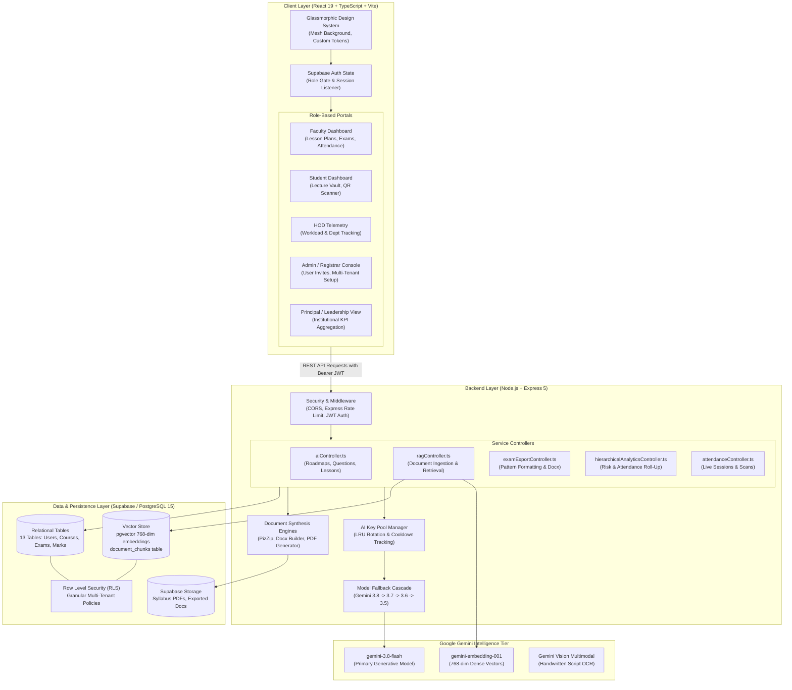
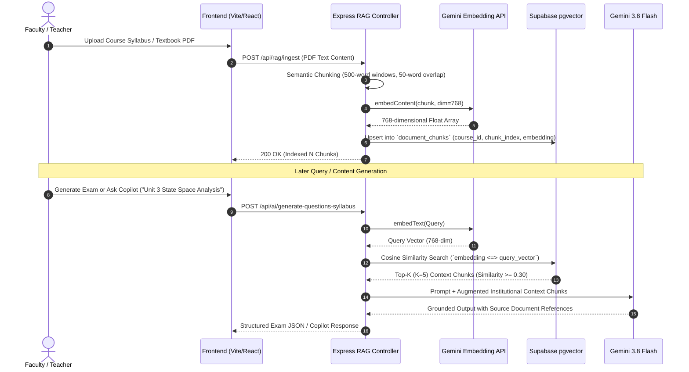
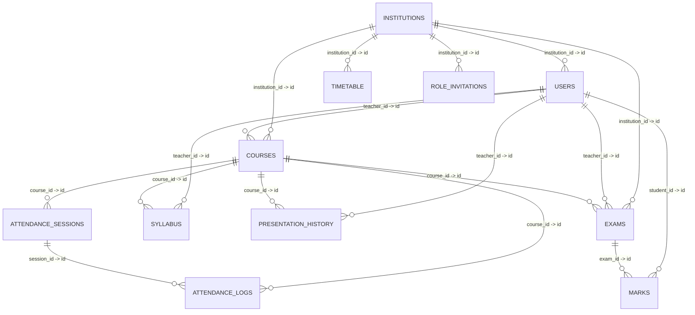

# Velaar

<div align="center">

**Enterprise Higher Education AI Academic Management & RAG Platform**

[](LICENSE)
[](https://react.dev)
[](https://www.typescriptlang.org)
[](https://expressjs.com)
[](https://supabase.com)
[](https://github.com/pgvector/pgvector)
[](https://deepmind.google/technologies/gemini/)
[](https://vitejs.dev)

<p align="center">
  A unified operating system for modern universities and engineering colleges—bridging faculty lesson planning, institutional exam paper compilation, computer-vision attendance, outcome-based education (OBE) telemetry, and grounded semantic vector search across campus syllabi.
</p>

</div>

---

## Table of Contents

- [Executive Summary](#-executive-summary)
- [System Architecture](#-system-architecture)
  - [High-Level Architecture](#high-level-architecture)
  - [Component Architecture & Protocol Flow](#component-architecture--protocol-flow)
- [Retrieval-Augmented Generation (RAG) Engine](#-retrieval-augmented-generation-rag-engine)
  - [Vector Pipeline Flow](#vector-pipeline-flow)
  - [Chunking & Embedding Specifications](#chunking--embedding-specifications)
- [High-Availability AI Infrastructure](#-high-availability-ai-infrastructure)
  - [Multi-Key LRU Rotation Pool](#multi-key-lru-rotation-pool)
  - [Dynamic Model Fallback Cascade](#dynamic-model-fallback-cascade)
- [Institutional Role Matrix & RBAC](#-institutional-role-matrix--rbac)
- [Deep-Dive Feature Modules](#-deep-dive-feature-modules)
  - [1. Course & Syllabus Intelligence Studio](#1-course--syllabus-intelligence-studio)
  - [2. Institutional Examination Studio](#2-institutional-examination-studio)
  - [3. Pedagogical Lesson Plan Generator](#3-pedagogical-lesson-plan-generator)
  - [4. Lecture Slide Deck & Presentation Synthesis](#4-lecture-slide-deck--presentation-synthesis)
  - [5. Smart Attendance & Live Classroom Sessions](#5-smart-attendance--live-classroom-sessions)
  - [6. Hierarchical Analytics & Student Risk Telemetry](#6-hierarchical-analytics--student-risk-telemetry)
  - [7. Student Learning Portal & Lecture Vault](#7-student-learning-portal--lecture-vault)
- [Database Schema & Entity-Relationship Architecture](#-database-schema--entity-relationship-architecture)
- [Backend API Reference](#-backend-api-reference)
- [Tech Stack](#-tech-stack)
- [Getting Started & Local Development](#-getting-started--local-development)
  - [Prerequisites](#prerequisites)
  - [Installation](#installation)
  - [Environment Variables](#environment-variables)
  - [Running the Services](#running-the-services)
- [Project Directory Structure](#-project-directory-structure)
- [License & Intellectual Property](#-license--intellectual-property)
- [Author & Contact](#-author--contact)

---

## Executive Summary

Modern higher-education institutions face fragmented workflows: syllabi remain static PDFs, lesson planning takes hours of manual formatting, exam generation risks question duplication and syllabus misalignment, and accreditation bodies (like **NBA** and **NAAC**) require arduous Course Outcome (CO) and Program Outcome (PO) mapping.

**Velaar** eliminates this administrative burden. Built with a high-performance **React 19** frontend, an **Express 5** micro-tier backend, and **Supabase (PostgreSQL 15 + pgvector)**, Velaar automates:
1. **Syllabus-to-Course Automation**: Instant conversion of unstructured syllabus PDFs into modular lecture plans, day-wise lesson plans, and Bloom's Taxonomy-aligned exams.
2. **Context-Grounded Intelligence**: Vector similarity retrieval (`pgvector`) ensuring AI generations cite institutional documents and prevent hallucinations.
3. **University Document Compilation**: Programmatic compilation of official college Word (`.docx`) and PDF documents with university headers, course codes, and marking schemes.
4. **Resilient AI Operations**: Enterprise-grade multi-key LRU pooling with automatic fallback to keep campus workloads alive during free/tier-1 API quota spikes.
5. **Hierarchical Academic Telemetry**: Roll-up telemetry from individual student marks and attendance to Teacher class averages, HOD departmental overviews, and Principal executive dashboards.

---

## System Architecture

### High-Level Architecture



### Component Architecture & Protocol Flow

```
┌─────────────────────────────────────────────────────────────────────────────────┐
│                              FRONTEND (PORT 5173)                                │
│   React 19 SPA • Tailwind / Vanilla Glassmorphic CSS • React Router DOM v7       │
└────────────────────────────────────────┬────────────────────────────────────────┘
                                         │  HTTPS / JSON API Requests
                                         ▼
┌─────────────────────────────────────────────────────────────────────────────────┐
│                               BACKEND (PORT 5000)                               │
│  ┌───────────────────────┐   ┌───────────────────────┐   ┌───────────────────┐  │
│  │ Express Auth / Rate   │──>│ LRU Key Pool Manager  │──>│ Gemini SDK Client │  │
│  │ Limit (100 req/15min) │   │ (email:key LRU state) │   │ (@google/genai)   │  │
│  └───────────────────────┘   └───────────────────────┘   └─────────┬─────────┘  │
│                                                                    │            │
│  ┌───────────────────────┐   ┌───────────────────────┐             │            │
│  │ Docx & PDF Exporters  │<──│ RAG Semantic Search   │<────────────┘            │
│  │ (PizZip, DocxBuilder) │   │ (Cosine similarity)   │                          │
│  └───────────────────────┘   └───────────────────────┘                          │
└───────────────────┬────────────────────────────────────────┬────────────────────┘
                    │ PostgreSQL Connection                  │ Vector Operations
                    ▼                                        ▼
┌─────────────────────────────────────────────────────────────────────────────────┐
│                      SUPABASE / POSTGRESQL (CLOUD PERSISTENCE)                  │
│   • 13 Relational Tables (Courses, Exams, Users, Marks, Sessions)               │
│   • pgvector Extension (Cosine Distance <=> Match Indexing)                    │
│   • Row Level Security (Tenant & Role Segregated Isolation)                     │
└─────────────────────────────────────────────────────────────────────────────────┘
```

---

## Retrieval-Augmented Generation (RAG) Engine

The Velaar RAG architecture grounds all generated lecture content, study materials, and examination questions in official institutional curriculum files.

### Vector Pipeline Flow



### Chunking & Embedding Specifications

| Parameter | Value | Description |
|---|---|---|
| **Embedding Model** | `gemini-embedding-001` | High-accuracy dense representation |
| **Output Dimensions** | `768` | Fixed float vector matching PostgreSQL `vector(768)` |
| **Chunk Size** | 500 words | Balances topical cohesion and token efficiency |
| **Chunk Overlap** | 50 words | Preserves contextual continuity across chunk boundaries |
| **Distance Metric** | Cosine Distance (`<=>`) | Standard metric for normalized semantic embeddings |
| **Top-K Retrieval** | 5 Chunks | Optimal context injection for syllabus grounding |
| **Similarity Threshold** | `>= 0.30` | Filters irrelevant chunks before LLM ingestion |

---

## High-Availability AI Infrastructure

### Multi-Key LRU Rotation Pool

During campus hours, hundreds of faculty members simultaneously compile lesson plans, exams, and lecture notes. Relying on a single API key triggers Google Gemini free-tier and Tier-1 429 quota exceptions (`RESOURCE_EXHAUSTED`).

Velaar implements an automated **Least-Recently-Used (LRU) Key Pool Manager** in `backend/utils/gemini.ts`:

```
Incoming AI Request
       │
       ▼
┌────────────────────────────────────────┐
│ Parse `GOOGLE_API_KEYS`                │
│ format: email1:key1,email2:key2,...    │
└──────────────────┬─────────────────────┘
                   │
                   ▼
┌────────────────────────────────────────┐
│ Sort Keys by `lastUsedTimes` (Ascending│──> Key resting longest is picked
└──────────────────┬─────────────────────┘
                   │
                   ▼
┌────────────────────────────────────────┐
│ Execute Call with Selected Key         │
└──────┬───────────────────────────┬─────┘
       │ Success                   │ 429 / 503 Quota Error
       ▼                           ▼
[Update Key Cooldown]       [Auto-failover to Next Available Key]
```

### Dynamic Model Fallback Cascade

To survive upstream Google Cloud outages, high latency spikes, or temporary 503 capacity limitations, Velaar incorporates a 4-tier model cascade:

```
[Tier 1: gemini-3.8-flash] (Primary - Lowest Latency & High Reasoning)
            │  (Fails on 503 / 404 / 429)
            ▼
[Tier 2: gemini-3.7-flash] (Secondary Failover)
            │  (Fails on 503 / 404 / 429)
            ▼
[Tier 3: gemini-3.6-flash] (Tertiary Failover)
            │  (Fails on 503 / 404 / 429)
            ▼
[Tier 4: gemini-3.5-flash] (Emergency Fallback)
```

- **Exponential Backoff**: If all keys in a model tier return transient 503 errors, the engine pauses for 800ms before retrying a secondary pass.
- **Audit Telemetry**: Every call logs model identifier, input tokens, output tokens, teacher ID, and timestamp into the `ai_logs` Supabase table.

---

## Institutional Role Matrix & RBAC

Velaar enforces strict multi-tenant Row Level Security (RLS) and frontend route guards across **8 institutional roles**:

| Role | Target Persona | Key Capabilities & Dashboards |
|---|---|---|
| **Teacher / Faculty** | Professors, Lecturers, TAs | Syllabus parsing, lesson plan generator, exam builder, live attendance session host, marks entry, student risk diagnostics. |
| **Student** | Undergraduate / Graduate Students | Lecture Vault (course slides & notes), mobile QR attendance scanner, study flashcards, assignment hub. |
| **Head of Department (HOD)** | Department Chairs | Faculty workload analysis, course completion tracking, department-wide marks distribution, meeting minutes synthesizer. |
| **Institutional Admin** | IT Admins, College Management | Role invitation dispatcher, multi-department provisioning, system-wide AI token allocation, audit log telemetry. |
| **Principal / Dean** | College Leadership | College-wide academic health KPI roll-up, accreditation compliance summaries, cross-department comparison. |
| **Registrar** | Academic Office | Student enrollment validation, institutional registration records, division and batch allocations. |
| **Exam Controller** | University Examination Cell | Term Test and End-Semester exam scheduling, standardized question paper archiving, moderation records. |
| **Parent** | Guardians | Ward academic progress timeline, attendance threshold warnings (<75%), test score records. |

---

## Deep-Dive Feature Modules

### 1. Course & Syllabus Intelligence Studio
- **PDF Extraction**: Upload university syllabi (e.g., Mumbai University, VTU, SPPU) in PDF format.
- **Decomposition**: Deconstructs raw text into structured Units, Lecture Hours, Prerequisite Knowledge, and Core Competencies.
- **CO-PO Mapping**: Automatically generates Course Outcome (CO1–CO6) statements mapped to Program Outcomes (PO1–PO12) with Bloom's Taxonomy cognitive levels.

### 2. Institutional Examination Studio
- **Pattern Compliance**: Pre-configured institutional examination templates:
  - **Term Test 1 (TT1)**: 20 Marks, 1 Hour duration, mapped to CO1–CO3.
  - **Term Test 2 (TT2)**: 20 Marks, 1 Hour duration, mapped to CO4–CO6.
  - **End Semester Exam (ESE)**: 60/80 Marks, 2.5/3 Hours duration, comprehensive course coverage.
- **Interactive Question Editor**: Faculty can re-roll individual sub-questions, modify marks distributions, flag numerical vs. theoretical questions, and toggle Bloom's levels.
- **Official Word & PDF Export**: Produces ready-to-print `.docx` and `.pdf` question papers matching standard university formatting, including question grids, candidate instructions, and marking rubrics.

### 3. Pedagogical Lesson Plan Generator
- **Day-Wise & Week-Wise Enrichment**: Generates weekly class schedules with lesson topics, teaching pedagogy (Chalk-and-Talk, PPT, Flipped Classroom), instructional aids, and reference textbook chapters.
- **Cognitive Mapping**: Every single lecture is mapped against Bloom's taxonomy:
  - `Remember` → `Understand` → `Apply` → `Analyze` → `Evaluate` → `Create`
- **Instant Document Archival**: 1-click export to official college-formatted lesson plan dossiers for NBA/NAAC audit inspections.

### 4. Lecture Slide Deck & Presentation Synthesis
- Generates structured, slide-by-slide presentation outlines directly from course syllabus units.
- Generates key concepts, code snippets, discussion prompts, and visual diagram suggestions for classroom projection.

### 5. Smart Attendance & Live Classroom Sessions
- **Live Session Controller**: Teachers open a timed classroom attendance session tied to a specific subject and division.
- **Student Scanner**: Students scan a dynamic code or log in via mobile to verify presence in the classroom.
- **Instant Anomaly Flagging**: Highlights absent students, aggregates total lectures conducted vs. attended, and alerts faculty to proxy patterns.

### 6. Hierarchical Analytics & Student Risk Telemetry
- **At-Risk Classifier**: Continuously calculates student risk based on two primary signals:
  - **Attendance Threshold**: Automatic warning if attendance drops below mandatory 75%.
  - **Academic Deviation**: Detects students scoring below 40% in internal assessments.
- **Hierarchical Roll-Up**:
  - *Student Level* → Individual score card & risk status.
  - *Faculty Level* → Class average, pass/fail ratios per subject.
  - *HOD Level* → Departmental semester health & faculty performance.
  - *Principal Level* → Institution-wide retention & academic telemetry.

### 7. Student Learning Portal & Lecture Vault
- **Lecture Vault**: Centralized repository where students review lecture summaries, download study notes, and track subject-wise progress.
- **Interactive Study Aids**: Auto-generates study flashcards and practice test questions strictly derived from the professor's approved curriculum.

---

## Database Schema & Entity-Relationship Architecture

Velaar utilizes **13 interconnected PostgreSQL tables** hosted on Supabase with strict foreign-key integrity and multi-tenant indexing:



### Core Schema Table Reference

| Table Name | Primary Keys & Foreign Keys | Description |
|---|---|---|
| `institutions` | `id` (PK) | Top-level tenant container (name, domain, address, accreditation status). |
| `users` | `id` (PK), `institution_id` (FK) | Multi-role user records (email, full_name, user_type, department, semester). |
| `courses` | `id` (PK), `teacher_id` (FK), `institution_id` (FK) | Academic courses (subject_name, code, semester, exam_patterns, syllabus data). |
| `document_chunks` | `id` (PK), `course_id` (FK) | RAG vector chunks with 768-dim embeddings (`vector(768)`) and metadata. |
| `exams` | `id` (PK), `course_id` (FK), `teacher_id` (FK) | Generated examinations, question configurations, marks schemas, and duration. |
| `marks` | `id` (PK), `exam_id` (FK), `student_id` (FK) | Student examination scores, question-wise breakdown, and grade records. |
| `attendance_sessions` | `id` (PK), `course_id` (FK), `teacher_id` (FK) | Live classroom sessions with start/end timestamps and session status. |
| `attendance_logs` | `id` (PK), `session_id` (FK), `student_id` (FK) | Individual student presence timestamps and verification status. |
| `syllabus` | `id` (PK), `course_id` (FK), `teacher_id` (FK) | Structured unit breakdowns, lecture hours, and course outcomes. |
| `presentation_history`| `id` (PK), `course_id` (FK), `teacher_id` (FK) | Slide decks and lecture presentations generated for classroom display. |
| `timetable` | `id` (PK), `institution_id` (FK) | Department weekly class schedules, room allocations, and slot matrices. |
| `role_invitations` | `id` (PK), `institution_id` (FK) | Pre-provisioned user invites with role, department, semester, and division. |
| `ai_logs` | `id` (PK) | Audit telemetry: action, tokens used, latency, teacher ID, and timestamp. |

---

## Backend API Reference

All backend routes are mounted under `/api` and protected by JWT authentication and IP rate-limiters.

### AI & Content Generation (`/api/ai`)
| Method | Endpoint | Description |
|---|---|---|
| `POST` | `/api/ai/parse-syllabus` | Extracts units, topics, and hours from raw syllabus text/PDF. |
| `POST` | `/api/ai/generate-roadmap` | Generates a 15-week lecture roadmap from course topics. |
| `POST` | `/api/ai/generate-lesson-plan` | Compiles a full semester lesson plan aligned to Bloom's taxonomy. |
| `POST` | `/api/ai/generate-questions-syllabus` | Generates university-format exam questions grounded in syllabus. |
| `POST` | `/api/ai/generate-questions-topics` | Generates targeted questions for specific units or topics. |
| `POST` | `/api/ai/generate-lecture-presentation` | Produces lecture slide deck outlines for classroom teaching. |
| `POST` | `/api/ai/generate-copo-mapping` | Computes Course Outcome to Program Outcome correlation matrices. |
| `POST` | `/api/ai/copilot-chat` | Context-aware AI copilot grounded in uploaded course documents. |
| `POST` | `/api/ai/generate-rubric` | Generates marking rubrics and model solutions for exam papers. |
| `POST` | `/api/ai/evaluate-answer-script` | Multimodal evaluation of handwritten answer script photos. |

### RAG Vector Service (`/api/rag`)
| Method | Endpoint | Description |
|---|---|---|
| `POST` | `/api/rag/ingest` | Chunks and embeds syllabus/notes into Supabase `pgvector`. |
| `POST` | `/api/rag/query` | Semantic vector search returning top-K relevant syllabus context. |
| `DELETE` | `/api/rag/clear` | Deletes vector embeddings for a specific course or teacher. |

### Document Exporters (`/api/export`)
| Method | Endpoint | Description |
|---|---|---|
| `POST` | `/api/export/exam-paper` | Compiles and streams a formatted Microsoft Word (`.docx`) exam paper. |
| `POST` | `/api/export/lesson-plan` | Compiles and streams an official Word (`.docx`) lesson plan dossier. |
| `POST` | `/api/export/timetable-pdf` | Exports weekly schedule grid as a printable PDF. |

### Analytics & Administration (`/api/admin`, `/api/analytics`)
| Method | Endpoint | Description |
|---|---|---|
| `GET` | `/api/admin/ai-usage` | Token telemetry, call frequency, and cost estimates across departments. |
| `GET` | `/api/analytics/hod/:hodId` | Departmental performance roll-up, course completion, and faculty workload. |
| `GET` | `/api/analytics/principal` | Institution-wide KPIs, retention analytics, and attendance telemetry. |

---

## Tech Stack

| Layer | Technology | Purpose |
|---|---|---|
| **Frontend Framework** | React 19.2 + TypeScript 5.x | High-performance reactive UI with strict type safety |
| **Build Tool & Bundler** | Vite 6.x | Sub-second HMR and optimized production bundling |
| **Styling & Design System** | Vanilla CSS + Glassmorphism Tokens | Sleek dark-mode aesthetic with mesh gradients and skeletons |
| **Backend Runtime** | Node.js 18+ / Express 5.2 | Scalable REST API with modern async middleware support |
| **Database & Vector Store** | Supabase (PostgreSQL 15) | Relational persistence with native `pgvector` vector extension |
| **AI Models** | Google Gemini (`gemini-3.8-flash`) | Ultra-fast multimodal reasoning and structured JSON generation |
| **Embeddings** | Google `gemini-embedding-001` | 768-dimensional dense vector embeddings |
| **Document Generation** | PizZip + DocxBuilder + PDFKit | Native binary compilation of `.docx` and `.pdf` files |
| **Security & Optimization** | Express Rate Limit + RLS + CORS | DDOS protection, multi-tenant isolation, and rate-limiting |

---

## Getting Started & Local Development

### Prerequisites

Ensure you have the following installed on your local environment:
- **Node.js**: `v18.18.0` or higher
- **npm**: `v9.x` or higher
- **Supabase Account**: With a running PostgreSQL instance and `pgvector` enabled
- **Google Gemini API Key(s)**: From [Google AI Studio](https://aistudio.google.com/)

### Installation

1. **Clone the repository:**
   ```bash
   git clone https://github.com/bhavya-darjii/velaar.git
   cd velaar
   ```

2. **Install dependencies:**
   ```bash
   npm install
   ```

### Environment Variables

Create a `.env` file in the root directory:

```env
# Frontend Configuration (Vite)
VITE_SUPABASE_URL=https://your-project.supabase.co
VITE_SUPABASE_ANON_KEY=your_supabase_anon_key
VITE_API_URL=http://localhost:5000/api

# Backend Configuration (Express)
PORT=5000
SUPABASE_URL=https://your-project.supabase.co
SUPABASE_SERVICE_ROLE_KEY=your_supabase_service_role_key

# Google Gemini API Key Pool (Supports multiple keys for LRU rotation)
# Format: email1:key1,email2:key2 OR single key AIzaSy...
GOOGLE_API_KEYS=faculty1@college.edu:AIzaSyKeyOne,faculty2@college.edu:AIzaSyKeyTwo
```

### Running the Services

```bash
# Start both frontend and backend concurrently in development mode
npm run dev

# Start only the frontend Vite development server (Port 5173)
npm run dev:frontend

# Start only the backend Express API server with hot-reload (Port 5000)
npm run dev:backend

# Verify TypeScript types across the entire project
npm run type-check

# Run test RAG retrieval query against Supabase pgvector
npm run test-rag

# Build production bundles
npm run build
```

The frontend will be available at `http://localhost:5173` and the API at `http://localhost:5000`.

---

## Project Directory Structure

```
velaar/
├── backend/                             # Express 5 Backend Application
│   ├── controllers/                     # API Route Handlers
│   │   ├── adminController.ts           # Token usage and admin metrics
│   │   ├── aiController.ts              # Syllabi, roadmaps, lesson plans, questions
│   │   ├── examExportController.ts      # Word (.docx) exam paper compilation
│   │   ├── exportController.ts          # Lesson plan & timetable file exporters
│   │   ├── hierarchicalAnalyticsController.ts # Roll-up risk & attendance telemetry
│   │   ├── ragController.ts             # Document chunk ingestion & vector search
│   │   ├── rubricController.ts          # Exam rubrics & answer script grading
│   │   └── timetableController.ts       # Class scheduling & conflict resolution
│   ├── middleware/                      # Auth guards, CORS, Express rate limiters
│   ├── prompts/                         # Tuned prompts for Bloom's taxonomy & exams
│   ├── routes/                          # Express REST endpoint routers
│   ├── services/                        # RAG service & vector embedding logic
│   ├── utils/                           # Gemini LRU key pool & docx builders
│   ├── supabaseAdmin.ts                 # Service-role Supabase client
│   └── index.ts                         # Express server entry point
│
├── frontend/                            # React 19 Frontend Application
│   ├── components/                      # Reusable glassmorphic UI components
│   │   ├── auth/                        # Protected route guards & role gates
│   │   ├── shared/                      # Mesh background, global copilot drawer
│   │   └── skeletons/                   # Loading skeleton screens
│   ├── context/                         # AuthContext & CopilotContext providers
│   ├── layouts/                         # Teacher, Student, HOD, Admin layout shells
│   ├── pages/                           # Role-specific application views
│   │   ├── admin/                       # User management & institutional settings
│   │   ├── auth/                        # Login and account provisioning
│   │   ├── hod/                         # Departmental health & teacher workloads
│   │   ├── student/                     # Lecture vault & attendance scanner
│   │   └── teacher/                     # Lesson plan, exam editor, marks, attendance
│   ├── services/                        # Supabase client & backend API callers
│   ├── styles/                          # Global CSS variables & glassmorphism tokens
│   ├── App.tsx                          # Master routing tree & role redirection
│   └── main.tsx                         # React 19 virtual DOM root
│
├── docs/                                # Institutional documentation & DB schemas
│   ├── DATABASE_SCHEMA.md               # Live Supabase schema extraction & ERD
│   ├── hierarchical_analytics_design.md # Multi-tier academic telemetry design
│   └── Business Plan for Velaar         # Commercial roadmap & institutional strategy
│
├── package.json                         # Monorepo dependencies & unified scripts
├── tsconfig.json                        # Root TypeScript configuration
└── vite.config.ts                       # Vite bundler configuration
```

---

## License & Intellectual Property

**Copyright © 2026 Bhavya Darji. All Rights Reserved.**

This software, including all source code, design systems, algorithms, and documentation, is **confidential, private, and proprietary**. Unauthorized copying, reverse engineering, redistribution, sublicensing, or public deployment of this codebase, via any medium, is strictly prohibited without express prior written consent from the author.

---

## Author & Contact

**Bhavya Darji**  
Founder & Full-Stack Architect

- **Portfolio:** [bhavya-darji.vercel.app](https://bhavya-darji.vercel.app/)  
- **GitHub:** [@bhavya-darjii](https://github.com/bhavya-darjii)  
- **LinkedIn:** [Bhavya Darji](https://www.linkedin.com/in/bhavya-darji-181573242/)  
- **Email:** [bhavyadarji462@gmail.com](mailto:bhavyadarji462@gmail.com)

---

<p align="center">Made with ❤️ by <a href="https://bhavya-darji.vercel.app/" target="_blank" rel="noopener noreferrer"><strong>Bhavya Darji</strong></a></p>
